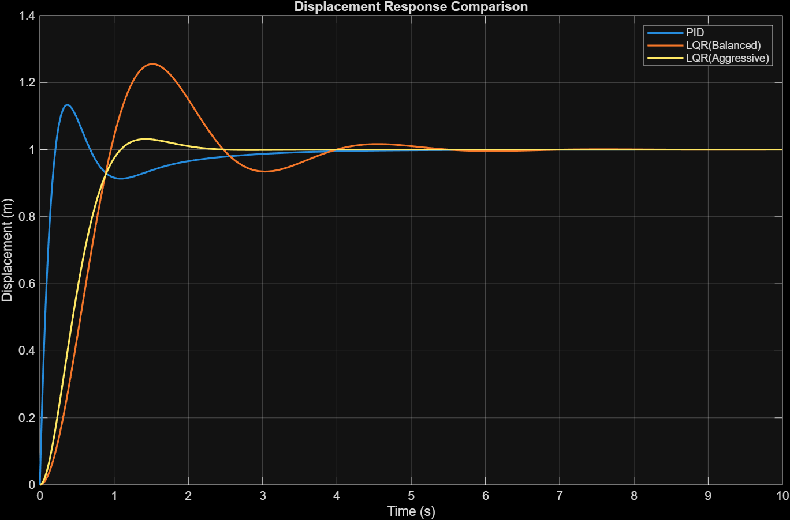
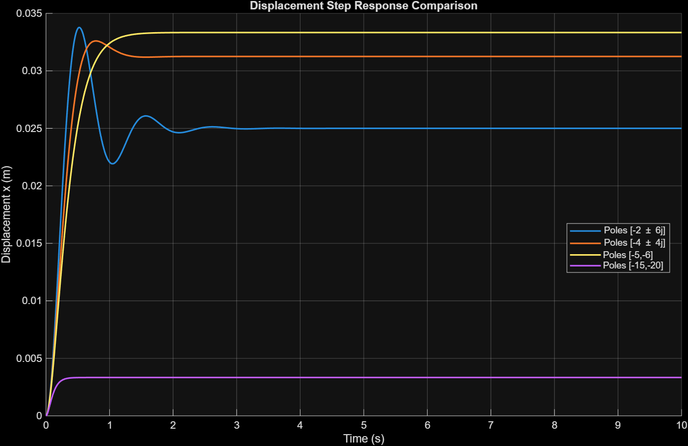
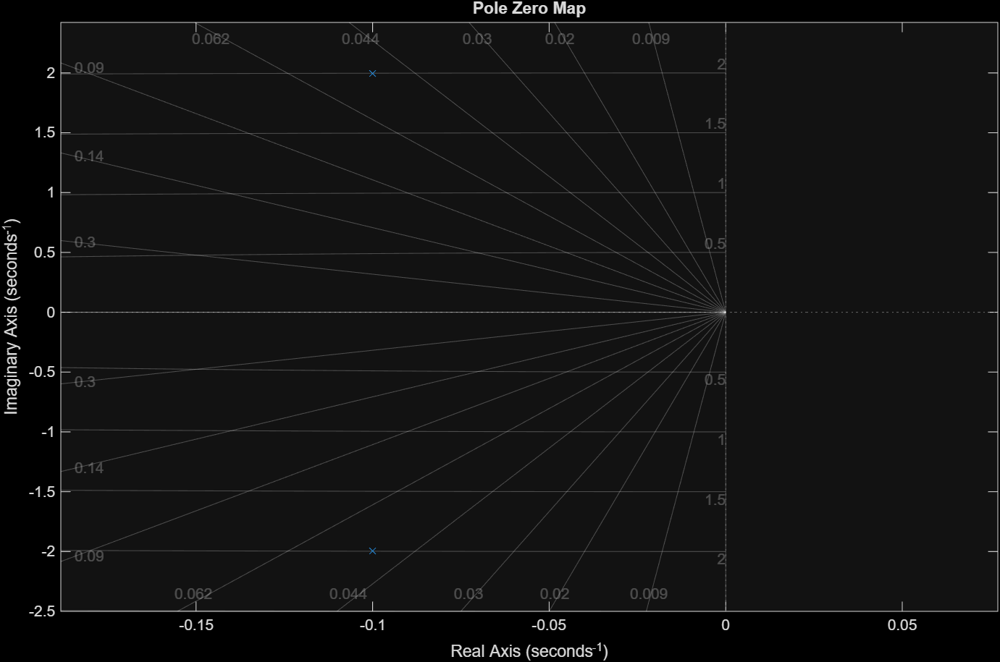
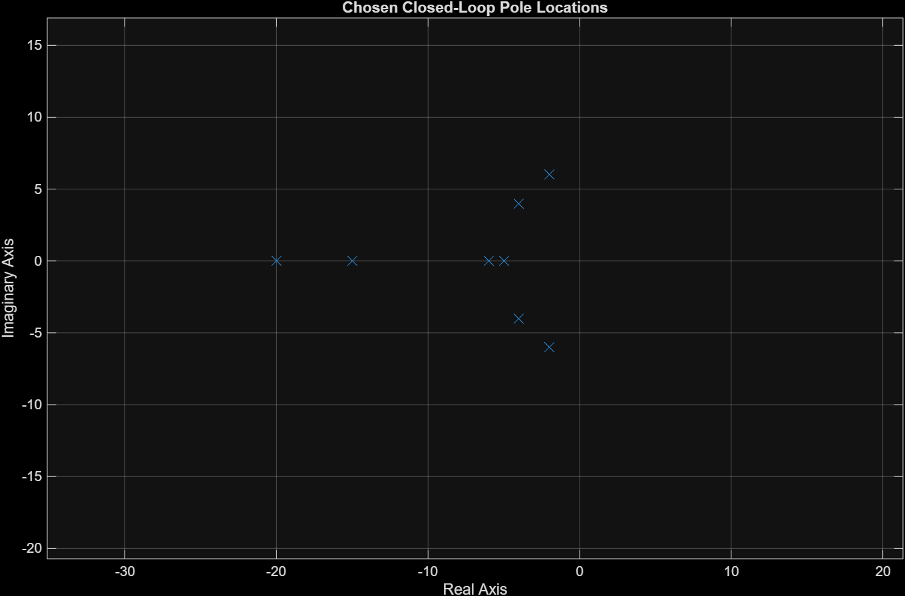
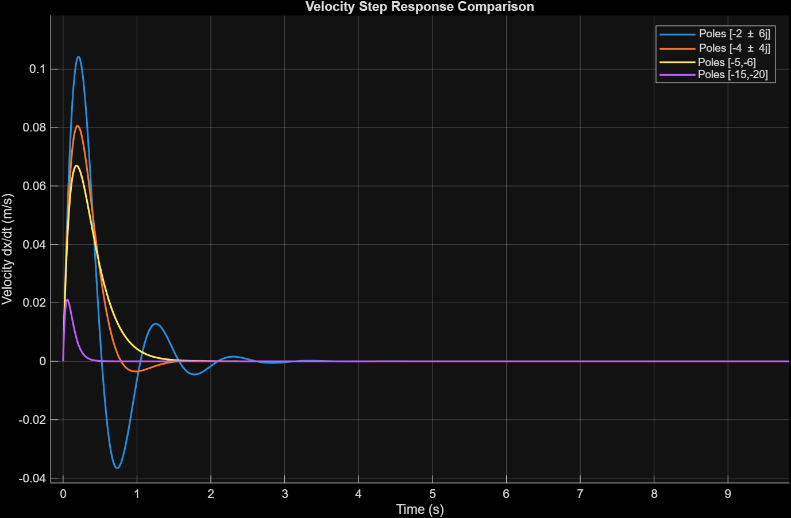
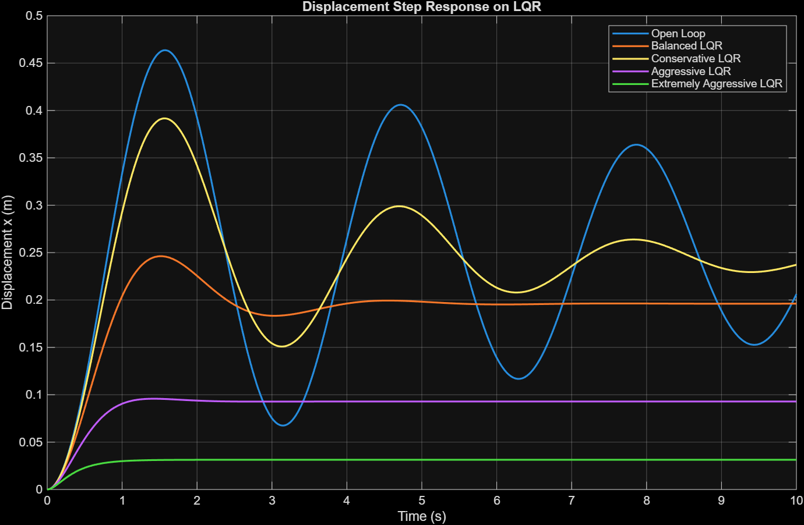
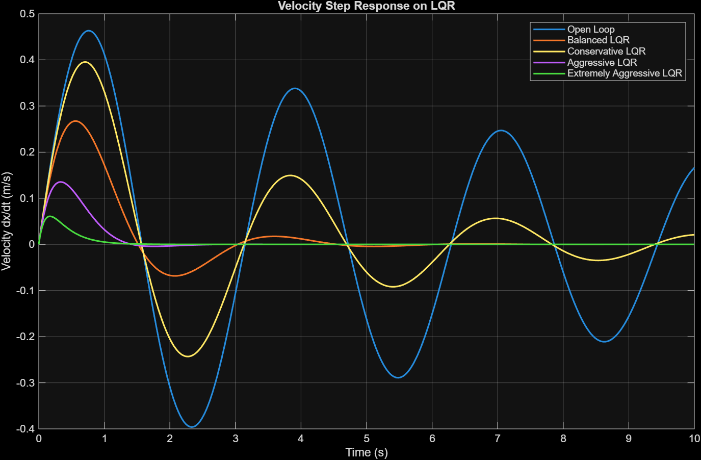

# Mass-Spring-Damper-Control-using-LQR-and-Comparison-with-Standard-PID-Tuning
## Overview
Design and analysis of a mass-spring-damper system using state-space methods. Implements pole placement and LQR control, and compares their performance with a tuned PID controller through transient response metrics, stability analysis, and step-response simulations.

## A few fun plots encountered!

## System Model
The dynamics of the system are given by
> mẍ + cẋ + kx = u
where:

m = Mass
c = Damping coefficient
k = Spring stiffness
u = Applied control force

The system was converted to state-space form and analyzed using MATLAB's Control System Toolbox.
For the sake of this project, the system parameters used were:

| Parameter | Value |
|------------|--------|
| Mass (m) | 1 kg |
| Spring Constant (k) | 4 N/m |
| Damping Coefficient (b) | 0.2 kg/s |

### Natural Response:

### Open Loop Response(Step Input):

### Pole-Zero Map:

From the Pole-Zero Map, we can see that the eigen-values of our system are:
> -0.1000 ± 1.9975i
From the Natural and Forced Response plots, as well as the eigenvalues, it is evident that the system is lightly damped and exhibits significant oscillatory behavior before settling.

## Control Design Workflow
### Open-Loop Analysis

The open-loop response was studied to understand the natural dynamics of the system and establish a baseline for controller design.

### Pole Placement

Multiple closed-loop pole configurations were tested to examine the effects of damping ratio and pole location on system behavior.

### Linear Quadratic Regulator (LQR)

Several LQR controllers were designed using different state and control weighting matrices. The influence of tuning the Q and R matrices on transient performance was investigated.

### PID Control

A PID controller was designed using MATLAB's pidtune() function and used as a benchmark against the state-feedback controllers.

## Results and Analysis
### Pole Placement 
Arbitrary poles were placed at:
- \(-2 \pm 6i\)
- \(-4 \pm 4i\)
- \(-5,\,-6\)
- \(-15,\,-20\)

The following Responses were generated:

#### Observations:

- Poles closer to the imaginary axis produced slower responses and increased oscillations.
- Moving the poles further into the left-half plane reduced settling time and improved damping.
- Aggressive pole placement (-15,-20) resulted in faster responses at the cost of higher control effort.

### Linear Quadratic Regulator (LQR)
#### Motivation:
While pole placement provides direct control over closed-loop eigenvalues, selecting pole locations becomes increasingly difficult as system complexity grows. Furthermore, pole placement does not explicitly account for the trade-off between state regulation and control effort. These limitations motivate the use of the Linear Quadratic Regulator (LQR), which systematically computes an optimal state-feedback gain by minimizing a quadratic cost function.

#### Cost Function

The LQR controller minimizes the performance index

> J = ∫(xᵀQx + uᵀRu)dt

where Q penalizes the system states and R penalizes the control effort.

#### Controller Design

The optimal gain matrix K was obtained using MATLAB's `lqr()` function. The closed-loop dynamics are given by

> ẋ = (A - BK)x

#### Tuning of Q and R

Several weighting matrices were tested to study their influence on transient response characteristics.

#### Results and Discussion

- Increasing Q produced a more aggressive controller.
- Higher state penalties reduced settling time and overshoot.
- The choice of Q and R significantly influenced closed-loop performance.

### PID Controller Design
#### Motivation 
PID controllers remain one of the most widely used control strategies due to their simplicity, ease of implementation, and effectiveness for low-order systems. A PID controller was designed to serve as a benchmark against the state-feedback controllers.

### Reference Tracking 
Since LQR is inherently a regulator, a reference gain was introduced to enable unit-step tracking. This ensured that both PID and LQR controllers were evaluated on the same tracking task.
The control law is given by:
> u = -Kx + N_r r 
where `N_r` is the reference gain used to eliminate steady-state tracking error.

### PID vs LQR Comparison 
#### Closed-Loop Tracking Performance

#### Observations
- The PID controller responds the fastest and reaches the reference value earliest.
- The baseline LQR design exhibits significant oscillations before settling.
- The tuned LQR design produces a smoother response with improved damping.
- Tuning the LQR weighting matrices noticeably improves transient behavior.
- All controllers successfully track the unit-step reference.
- The comparison highlights the trade-off between response speed and transient smoothness.

### Performance Metrics

| Performance Metric | PID | LQR (Balanced) | LQR (Aggressive) |
|-------------------|-----|----------------|------------------|
| Rise Time (s) | 0.1555 | 0.6478 | 0.6868 |
| Settling Time (s) | 2.5392 | 3.7243 | 1.7738 |
| Peak Time (s) | 0.3623 | 1.5355 | 1.4225 |
| Peak Value | 1.1329 | 1.2552 | 1.0316 |
| Overshoot (%) | 13.2934 | 25.5217 | 3.1599 |

#### Interpretation
- The PID controller achieved the fastest rise time, reaching the reference value significantly quicker than both LQR designs.
- The baseline LQR controller exhibited the highest overshoot and longest settling time, indicating that the initial choice of weighting matrices was not optimal.
- Tuning the LQR weighting matrices dramatically improved performance, reducing overshoot from 25.5% to 3.2% and settling time from 3.72 s to 1.77 s.
- Although the tuned LQR controller responded slightly slower initially than the PID controller, it provided a much smoother transient response with minimal overshoot.
- These results demonstrate that LQR performance is highly sensitive to the selection of the weighting matrices and can outperform a conventional PID controller when properly tuned.

## Conclusion

This project explored the control of a mass-spring-damper system using state-space and classical control techniques. Open-loop analysis revealed that the system was lightly damped and highly oscillatory, motivating the need for feedback control.

Pole placement demonstrated how closed-loop eigenvalues directly influence transient response characteristics. LQR control was then implemented to systematically balance state regulation and control effort through an optimal cost function. Comparison with a conventionally tuned PID controller showed that controller performance depends strongly on design choices and tuning parameters.

While the PID controller achieved the fastest initial response, tuning the LQR weighting matrices resulted in significantly lower overshoot and improved settling performance. The project provided practical experience with state-space modeling, stability analysis, pole placement, optimal control design, reference tracking, and controller performance evaluation.

